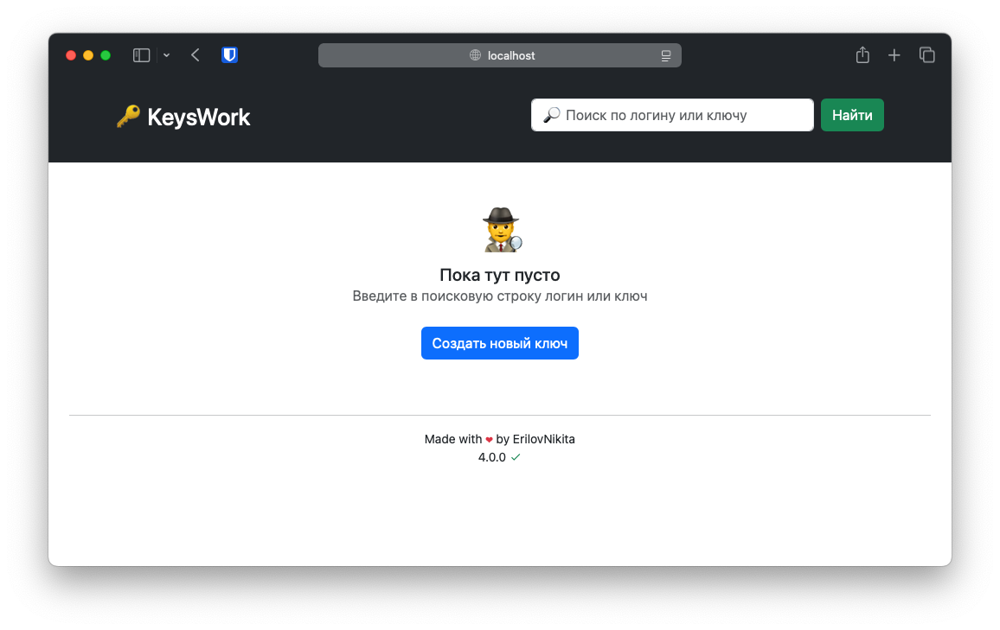
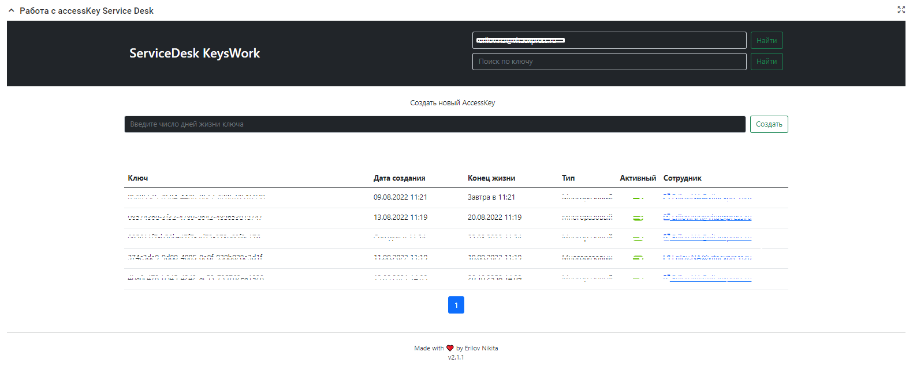

# 🔑 KeysWork - Встроенное приложение NSD 

Встроенное приложение для работы с AccessKey.
Сильно упросит работу и поможет быстро управлять доступами по ключам в вашей системе.
> Приложение еще не полностью автономно, для корректной работы необходим доступ к следующим хостам:
> * cdnjs.cloudflare.com
> * cdn.jsdelivr.ne

## Запуск приложения
> Все настройки должны производиться знающими людьми в режиме технолога

1. Установить модуль из папки *modules* на вашк платформу.
1. Добавить новое встроенное приложение, исполняемое на стороне клиента, указать путь до архива с приложением, высота по-умолчанию 800px.
1. Добавить новый контент с типом **Встроенное приложение** на карточку.
1. ✨ Радоваться


## Todo
- [x] Переписать на Vue 3 + TypeScript + Vite
- [x] Добавить Papia для работы с состоянием
- [x] Добавить поддержку проверки версионности через репозиторий GitHub
- [x] Реализовать DevMode
- [x] Добавить параметры контента для конфигурирования DevMode
- [x] Добавить функцию быстрого копирования ключей

## DevMode
В приложении реализован режим отладки. C его помощью появляется возможность быстрее отлаживать изменения, а также использование приложения вне платформы NSD.
Активация режима происходит из параметров контента встроенного приложения при размещении, необходимо будет указать адрес сервера и токен для общения.
Так же есть возможность сделать это модифицировав файл `config.ts` и собрать приложение самостоятельно.
``` ts
const manifest = {
    ...
    "DEV_URL" : "URL_INSTANCE",
    "DEV_TOKEN" : "YOUR_TOKEN",
    "DEV_MODE" : true,
    ...
}
```

## Скриншоты
 
