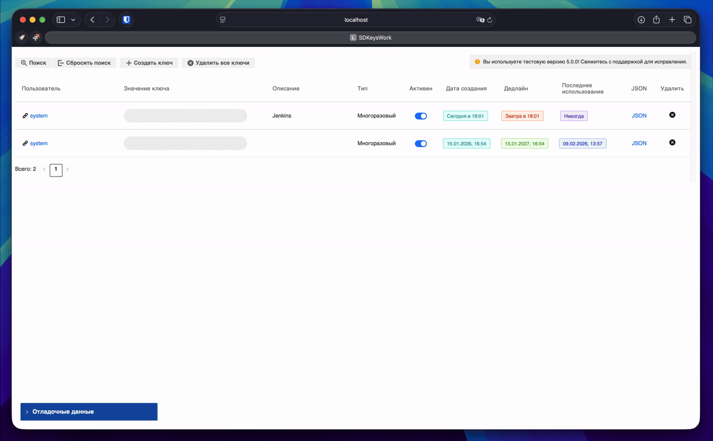

# 🔑 KeysWork

Встроенное приложение для работы с ключами доступа.
Сильно упросит работу и поможет быстро управлять доступами по ключам в вашей системе.

## Запуск приложения
> Все настройки должны производиться знающими людьми в режиме технолога

1. Установить модуль [nsd.modules.web_api_components](https://github.com/exeki/nsd.modules.web_api_components) (на нем работает бекенд-модуль приложения)
2. Установить модуль из папки *modules* на вашу платформу.
3. Добавить новое встроенное приложение, исполняемое на стороне клиента, указать путь до архива с приложением, высоту можно указать любую
4. Добавить новый контент с типом **Встроенное приложение** на карточку.
5. ✨ Радоваться

## Конфигурация и доступы
Конфигурация приложения происходит через изменение параметров [модуля](modules/keysWork.groovy).
Параметры хранятся в классе Parameters (в самом верху модуля).
Параметр "ALLOW_TO_ALL_IN_TEST_ENV" при включении дает возможность любым пользователям управлять своими (только) ключами на тестовых инсталляциях СД.
Тестовые инсталляции указываются в параметре TEST_HOSTS. Определение, является ли текущая инсталляция тестовой, происходит путем сравнения api.web.getBaseUrl() с указанными инсталляциями. 
Если инсталляция не указана в списке TEST_HOSTS - окружение считается продакшеном, доступ всем пользователям, кроме суперпользователей, будет запрещен. 

## Todo
- [x] Добавить поддержку проверки версионности через репозиторий GitHub
- [x] Добавить поддержку [темной темы](https://github.com/ErilovNikita/naumen-dark-theme)
