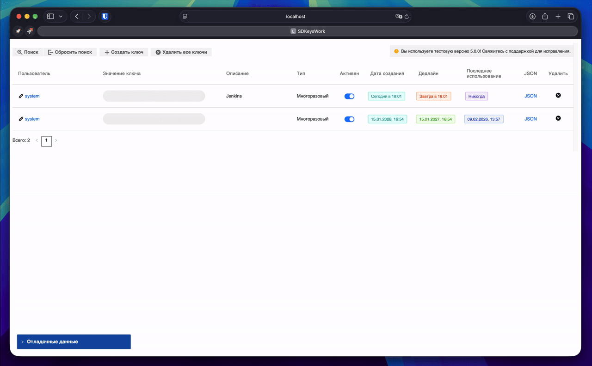

# 🔑 KeysWork

> Встроенное приложение для работы с ключами доступа в рамках Naumen Service Desk.

[](https://opensource.org/licenses/MIT)
[](https://github.com/ErilovNikita/SDKeysWork/releases/latest)




> [!TIP]
> Данный шаблон использует библиотеку [`@minitwiks/js-api`](https://www.npmjs.com/package/@minitwiks/js-api) — форк, адаптированный для
работы с `Vue` и типизированными данными.

## Возможности
- Просмотр ключей доступа
    - Всех пользователей
    - Конкретного пользователя
- Быстрое копирование значений ключа в буфер
- Фильтрация
    - По логину
    - По значению ключа
- Конфигурируемые столбцы
- Поддержка оформления инсталляции
- Отображение дат создания, дедлайна, использования ключей
- Включать/отключать доступы к конкретным ключам
- Удобно создавать новые ключи с указанием описания и дедлайна
- Удалять неиспользуемые ключи

Также приложение поддерживает дополнительные функции:

- Автоматическое отслеживание версии приложения
- Настройка типов инсталляции для размещения *Production* | *Development*
- Возможность настройки доступа для любых пользователей на просмотр своих ключей

## Установка приложения
> [!WARNING]
> Все настройки должны производиться в режиме технолога.

> [!TIP]
> Для корректной работы приложения требуется дополнительный
модуль [nsd.modules.web_api_components](https://github.com/exeki/nsd.modules.web_api_components)

> [!TIP]
> Для версий >= 5.1.1 установка REST-модуля встроенного приложения больше не требуется: он загружается автоматически при загрузке приложения на инсталляцию.

1. Установить модуль `nsd.modules.web_api_components`.
2. Добавить встроенное приложение:
    1. Исполняемое на стороне клиента
    2. Высоту можно указать любую *(Приложение поддерживает автовыравнивание по высоте)*
3. Добавить новый контент с типом **Встроенное приложение** на карточку.
4. При необходимости настроить [доступы](#доступы)
5. ✨ Радоваться

## Доступы
Доступы к приложению настраиваются через параметры модуля.
Для указания пользовательских настроек необходимо создать модуль с любым удобным именем и указать в нём параметры:

> [!TIP]
> Имя пакета необходимо указывать, как в примере ниже:

```groovy
package ru.sdkeyswork.keysWork

class Config {
    static public final List<String> TEST_HOSTS = []
    static public final List<String> SUPERUSER_LOGINS = []
  	static public final Boolean ALLOW_TO_ALL_IN_TEST_ENV = false
}
```

|Название|Описание|
|-|-|
| `ALLOW_TO_ALL_IN_TEST_ENV` | Даёт возможность любым пользователям управлять **(только)** своими ключами на тестовых инсталляциях NSMP|
| `TEST_HOSTS` | Список тестовых инсталляций. Определение, является ли текущая инсталляция тестовой, происходит путём сравнения `api.web.getBaseUrl()` с указанными инсталляциями. Если инсталляция не указана в списке `TEST_HOSTS`, окружение считается *Production*, а доступ всем пользователям, кроме суперпользователей, будет запрещён. |
| `SUPERUSER_LOGINS` | Перечень логинов пользователей, которые будут считаться суперпользователями. |

## Настройка приложения
Настройки отображения доступны в контенте размещения ВП.

|Название|Описание|Значение по умолчанию|
|-|-|-|
|Скрывать ключи|Отображение анимированной заглушки для скрытия ключей|Да|


## License
Данный проект лицензирован по лицензии MIT — подробности см. в файле [LICENSE](LICENSE).